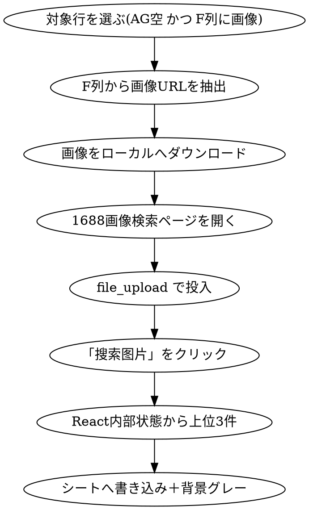

# 1688 仕入先候補の自動登録（/find-supplier）

2026-08-23

## 目的

リサーチシートの商品画像から 1688 の同款を画像検索し、**上位3件の仕入先候補**を
購入先・他仕入先1・他仕入先2の各列へ自動登録する。

現在は AliPrice 拡張を使って手作業で行っている（既存の購入先URLに
`kj_agent_plugin=aliprice` が残っていることから分かる）。ここを自動化する。

## 前提と制約

### 無人実行はできない

1688 はヘッドレスブラウザだとキャプチャ（`验证码拦截`）で遮断される。
**ユーザーのログイン済み Chrome（claude-in-chrome）を使う Claude セッション内でのみ動く。**
launchd の定期実行にはできない。

### 画像URLをパラメータで渡す方法は使えない

`https://s.1688.com/youyuan/index.htm?tab=imageSearch&imageAddress=<画像URL>` は
画像を取り込みキーワードも自動抽出するが、**検索結果は0件**になる（2枚の画像で再現）。

**ローカルファイルをアップロードする経路のみ有効。** アップロードすると `imageId` が発行され、
URLが `?tab=imageSearch&imageId=<id>&imageIdList=<id>` に変わって正しい結果が返る。

### 商品カードは React 要素でリンクを持たない

`a[href*="detail.1688.com/offer"]` は0件。ページ内のアンカー121本はすべて IM（チャット）リンク。
**React の内部状態（`__reactFiber$`）から取得する。** 商品画像 `img[src*="cbu01.alicdn.com"]` から
親を12階層まで遡り、`offerId` を持つオブジェクトを探す。

取得できるフィールド: `offerId` `loginId` `memberId` `offerPicUrl` `linkUrl` `province`
`companyName` `title` ほか。**価格のプロパティ名は未特定**（実装時にカードの表示テキストから拾う）。

## 処理の流れ



## 対象行の選び方

- **AG列（購入先）が空**、かつ **F列に画像がある**行のみ
- **既に購入先が入っている行は触らない。** 和田さんが選んだ仕入先を上書きしないため
- 引数で ASIN または行番号を指定できる。無指定なら上から順に処理
- 1行あたり30秒程度かかるため、既定の上限は10行（`--limit` で変更）

## 書き込み先

### 列はヘッダー名ではなく1行目のコードで引く

AR列と AW列は**どちらも3行目が `名称` で重複**するため、ヘッダー名では特定できない。
1行目の `LINK_BUY_OTHER1` / `LINK_BUY_OTHER2` は一意なので、こちらを使う。

### 対応表

| 候補 | URL | 通貨 | 価格(円) | 現地価格(元) |
|---|---|---|---|---|
| 1件目 | AG `LINK_LOWEST` | — | AH `PRICE_LOWEST` | AI `LOCALPRICE_LOWEST` |
| 2件目 | AR `LINK_BUY_OTHER1` | AT `CURRENCY_BUY_OTHER1` | AS `PRICE_BUY_OTHER1` | AU `LOCALPRICE_BUY_OTHER1` |
| 3件目 | AW `LINK_BUY_OTHER2` | AY `CURRENCY_BUY_OTHER2` | AX `PRICE_BUY_OTHER2` | AZ `LOCALPRICE_BUY_OTHER2` |

- **URL はクエリ文字列を落として書く**（`https://detail.1688.com/offer/{offerId}.html`）
- **現地価格**は元建ての数値をそのまま入れる
- **価格（円）は数式で入れる。** 既存行の AH と同じく `=AI{n}*24` の形（`=AU{n}*24` / `=AZ{n}*24`）
- **通貨は `CHY`**（ユーザー指定。ISO表記は `CNY` だが AT/AY 列は全行空で実績がないため指定に従う）
- **直送送料（AV `SHIPPING_INTL_OTHER1` / BA `SHIPPING_INTL_OTHER2`）には書かない**
- 1件目に通貨列は存在しない（`CURRENCY_LOWEST` が無いため）

### 自動で埋めたセルは背景をグレーにする

手入力と区別できるよう、**書き込んだセルだけ**背景を薄いグレー（`#EDEDED`）にする。
既に値が入っていて触らなかったセルの書式は変更しない。

## 実装場所

`marketar/research-tool` に `/find-supplier` コマンドとして追加する。
GAS からはブラウザを操作できないため、**GAS の `fetchAndWriteToSheet` とは別物**として並べる。

シートの読み書きは Python（gspread + `service_account.json`）で行う。
ブラウザ操作は claude-in-chrome の MCP ツールをコマンドの手順として記述する。

```
research-tool/
  .claude/commands/find-supplier.md     手順（ブラウザ操作を含む）
  src/domain/entities/supplier_candidate.py
  src/domain/value_objects/offer_id.py
  src/infrastructure/supplier_sheet_writer.py   列解決・書き込み・背景色
  src/usecases/fill_supplier_candidates.py      対象行の抽出と割り当て
  scripts/extract_candidates.js                 ページ内で実行するJS
```

## エラー処理

| 状況 | 挙動 |
|---|---|
| 検索結果が0件 | その行は何も書かず、ASIN と共にログへ残して次の行へ |
| 候補が3件未満 | 取れた分だけ書く（2件なら購入先と他仕入先1のみ） |
| キャプチャが出た | **その場で停止**し、ユーザーに手動での通過を依頼する。以降の行は処理しない |
| 画像のダウンロード失敗 | その行はスキップしてログへ残す |
| F列に画像が無い | 対象から除外（そもそも選ばれない） |

同一 `offerId` は除外して3件を選ぶ。

## テスト

ブラウザと Google Sheets への依存はインターフェース化し、モックでテストする。

| 対象 | 内容 |
|---|---|
| `OfferId` | `offerId` から URL を組み立てる。クエリ文字列を落とす |
| 列解決 | 1行目のコードから列番号を引く。`名称` の重複に影響されないこと |
| 数式生成 | 行番号に応じて `=AU5*24` を作ること |
| 割り当て | 3件・2件・0件それぞれで、どのセルに何を書くかが正しいこと |
| 対象行の抽出 | AG が埋まっている行を除外すること。F列に画像が無い行を除外すること |

ページ内で実行する JS（候補抽出）は、実際のDOMが必要なため自動テストの対象外とする。
代わりに取得できたフィールドをログへ出し、壊れたときに気づけるようにする。

## やらないこと

- 候補の自動採用の是非をユーザーに問い合わせる対話（自動で3件入れて、選ぶのは人）
- 直送送料の記入
- 既存の購入先の上書き
- launchd での定期実行
